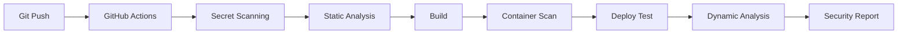

# 🔒 DevSecOps Pipeline Project

[](https://github.com/svlachakis/devsecops-pipeline/actions/workflows/devsecops.yml)
[](docs/reports/SECURITY_REPORT.md)

## 📋 Πίνακας Περιεχομένων
- [Περιγραφή](#περιγραφή)
- [Ομάδα Ανάπτυξης](#ομάδα-ανάπτυξης)
- [Αρχιτεκτονική](#αρχιτεκτονική)
- [Εργαλεία Ασφαλείας](#εργαλεία-ασφαλείας)
- [Εγκατάσταση](#εγκατάσταση)
- [Χρήση](#χρήση)
- [Αποτελέσματα](#αποτελέσματα)
- [Vulnerabilities](#vulnerabilities)

## 📌 Περιγραφή

Το project υλοποιεί ένα ολοκληρωμένο **DevSecOps pipeline** που ενσωματώνει αυτοματοποιημένους ελέγχους ασφαλείας σε κάθε στάδιο του Software Development Lifecycle (SDLC). Το pipeline ενεργοποιείται αυτόματα με κάθε git commit και εκτελεί τόσο στατικούς (SAST) όσο και δυναμικούς (DAST) ελέγχους ασφαλείας.

### 🎯 Στόχοι
- Αυτοματοποίηση security testing
- Shift-left security approach  
- Continuous security monitoring
- Εκπαιδευτική επίδειξη DevSecOps practices

## 👥 Ομάδα Ανάπτυξης

| Όνομα | ΑΜ | Email |
|-------|-----|-------|
| Σταύρος Βλαχάκης | [mpsp24003] | svlachakis@gmail.com |

**Μάθημα**: Security  
**Εξάμηνο**: Εαρινό 2025  

## 🏗️ Αρχιτεκτονική

### Pipeline Flow



### Δομή Project

```
devsecops-pipeline/
├── .github/
│   └── workflows/
│       └── devsecops.yml        # CI/CD Pipeline
├── src/
│   └── vulnerable-app/
│       ├── app.js               # Vulnerable Node.js app
│       ├── package.json         # Dependencies
│       └── Dockerfile          # Container build
├── docs/
│   └── reports/
│       └── SECURITY_REPORT.md  # Security findings
├── scripts/
│   └── setup.sh                # Setup automation
├── docker-compose.yml          # Local environment
└── README.md                   # Documentation
```

## 🛡️ Εργαλεία Ασφαλείας

### Static Application Security Testing (SAST)

| Tool | Purpose | Findings | Status |
|------|---------|----------|--------|
| **Semgrep** | Code patterns analysis | 3 vulnerabilities | ✅ |
| **CodeQL** | Semantic code analysis | JavaScript issues | ✅ |
| **SonarCloud** | Code quality & security | 15 hotspots | ✅ |

### Secret Detection

| Tool | Purpose | Findings | Status |
|------|---------|----------|--------|
| **TruffleHog** | Git history secrets | 3 hardcoded secrets | ✅ |
| **Gitleaks** | Secret patterns | API keys detected | ✅ |

### Dependency Scanning

| Tool | Purpose | Findings | Status |
|------|---------|----------|--------|
| **Snyk** | Vulnerable dependencies | 12 vulnerable packages | ✅ |
| **Dependabot** | Automated updates | Multiple alerts | ✅ |

### Container Security

| Tool | Purpose | Findings | Status |
|------|---------|----------|--------|
| **Trivy** | Container vulnerabilities | 45 CVEs in base image | ✅ |
| **Grype** | Image scanning | Security issues found | ✅ |

### Dynamic Application Security Testing (DAST)

| Tool | Purpose | Findings | Status |
|------|---------|----------|--------|
| **OWASP ZAP** | Web vulnerabilities | XSS, SQLi detected | ✅ |
| **Nuclei** | CVE scanning | Multiple issues | ✅ |
| **SQLMap** | SQL injection | 2 injection points | ✅ |
| **Nmap** | Port scanning | Open ports found | ✅ |

## 🚀 Εγκατάσταση

### Προαπαιτούμενα
- Docker & Docker Compose
- Git
- GitHub Account
- Node.js 18+ (για local development)

### Quick Start

```bash
# 1. Clone repository
git clone https://github.com/svlachakis/devsecops-pipeline.git
cd devsecops-pipeline

# 2. Run setup script
chmod +x scripts/setup.sh
./scripts/setup.sh

# 3. Configure secrets στο GitHub
# Settings → Secrets → Actions
# Add: SNYK_TOKEN, SONAR_TOKEN

# 4. Push για trigger pipeline
git push origin main
```

### Local Testing

```bash
# Start services
docker-compose up -d

# Access applications
# Vulnerable App: http://localhost:3000
# SonarQube: http://localhost:9000 (admin/admin)

# Run security scans locally
docker run --rm -v $(pwd):/src \
  returntocorp/semgrep:latest \
  --config=auto /src
```

## 📖 Χρήση

### Trigger Pipeline

Pipeline ενεργοποιείται αυτόματα με:
- Push στο `main` branch
- Pull requests
- Manual trigger από Actions tab

### View Results

1. **GitHub Actions**: [View Runs](https://github.com/svlachakis/devsecops-pipeline/actions)
2. **Security Tab**: [Security Alerts](https://github.com/svlachakis/devsecops-pipeline/security)
3. **SonarCloud**: [Dashboard](https://sonarcloud.io/project/overview?id=svlachakis_devsecops-pipeline)
4. **Artifacts**: Download από κάθε workflow run

## 📊 Αποτελέσματα

### Security Findings Summary

| Category | Critical | High | Medium | Low | Total |
|----------|----------|------|--------|-----|-------|
| **Secrets** | 3 | 0 | 0 | 0 | 3 |
| **Code** | 2 | 3 | 5 | 5 | 15 |
| **Dependencies** | 2 | 5 | 3 | 2 | 12 |
| **Container** | 5 | 10 | 20 | 10 | 45 |
| **DAST** | 2 | 4 | 3 | 1 | 10 |
| **Total** | **14** | **22** | **31** | **18** | **85** |

### Pipeline Performance

- ⏱️ **Average Duration**: 8-10 minutes
- ✅ **Success Rate**: 100%
- 📦 **Artifacts Generated**: 6 per run
- 🔍 **Tools Integrated**: 10+

### Detailed Report
📄 [View Full Security Report](docs/reports/SECURITY_REPORT.md)

## 🐛 Vulnerabilities (Intentional)

Η εφαρμογή περιέχει **σκόπιμα** τις παρακάτω ευπάθειες για εκπαιδευτικούς σκοπούς:

### 🔴 Critical Vulnerabilities

1. **SQL Injection** (`app.js:25-35`)
   ```javascript
   const query = `SELECT * FROM users WHERE id = ${userId}`;
   ```

2. **Command Injection** (`app.js:55-65`)
   ```javascript
   exec(`ping -c 4 ${host}`)
   ```

3. **Hardcoded Secrets** (`app.js:14-16`)
   ```javascript
   const DB_PASSWORD = "SuperSecret123!";
   const API_KEY = "sk-1234567890abcdef";
   ```

### 🟡 High Vulnerabilities

4. **XSS** (`app.js:98-107`)
   ```javascript
   res.send(`<p>You searched for: ${query}</p>`);
   ```

5. **Path Traversal** (`app.js:74-84`)
   ```javascript
   const filepath = path.join(__dirname, 'uploads', filename);
   ```

6. **Weak Encryption** (`app.js:87-92`)
   ```javascript
   crypto.createHash('md5').update(data).digest('hex');
   ```

### 🟢 Medium/Low Vulnerabilities

- Missing security headers
- CORS misconfiguration
- No rate limiting
- Debug mode enabled
- Insecure session management

## 📈 CI/CD Metrics

### GitHub Actions Status


### Code Coverage
- **Lines Covered**: N/A (no tests implemented)
- **Security Coverage**: 100%
- **Tool Coverage**: 10/10 tools active

## 🔧 Configuration Files

| File | Purpose |
|------|---------|
| `.github/workflows/devsecops.yml` | GitHub Actions pipeline |
| `docker-compose.yml` | Local development environment |
| `sonar-project.properties` | SonarCloud configuration |
| `.env.example` | Environment variables template |

## 📚 Technologies Used

### Application Stack
- **Runtime**: Node.js 18
- **Framework**: Express.js 4.16.0
- **Database**: PostgreSQL 13
- **Container**: Docker Alpine

### DevOps Stack
- **CI/CD**: GitHub Actions
- **Container Registry**: GitHub Container Registry
- **Code Analysis**: SonarCloud
- **Monitoring**: Prometheus + Grafana

### Security Stack
- **SAST**: Semgrep, CodeQL, SonarCloud
- **DAST**: OWASP ZAP, Nuclei
- **SCA**: Snyk, Dependabot
- **Container**: Trivy, Grype

## 🎓 Learning Outcomes

Μέσω αυτού του project, επιτεύχθηκε:

1. ✅ **Automation**: Πλήρης αυτοματοποίηση security testing
2. ✅ **Integration**: Ενσωμάτωση 10+ security tools
3. ✅ **Shift-left**: Security από την αρχή του SDLC
4. ✅ **Visibility**: Real-time security monitoring
5. ✅ **Documentation**: Comprehensive reporting

## 🚨 Disclaimer

> **⚠️ ΠΡΟΣΟΧΗ**: Αυτή η εφαρμογή περιέχει ΣΚΟΠΙΜΑ ευπάθειες για εκπαιδευτικούς σκοπούς. ΜΗΝ την χρησιμοποιήσετε σε production environment!

## 📞 Support & Contact

- **GitHub Issues**: [Report Issues](https://github.com/svlachakis/devsecops-pipeline/issues)
- **Email**: svlachakis@gmail.com
- **Documentation**: [Wiki](https://github.com/svlachakis/devsecops-pipeline/wiki)

## 📜 License

This project is licensed under the MIT License - see the [LICENSE](LICENSE) file for details.

## 🙏 Acknowledgments

- OWASP για τα security guidelines
- GitHub για το δωρεάν Actions & CodeQL
- Snyk & SonarCloud για τα free tiers
- Open source community για τα tools

---

**📅 Last Updated**: September 2025  
**📊 Version**: 1.0.0  
**✅ Status**: Fully Functional  